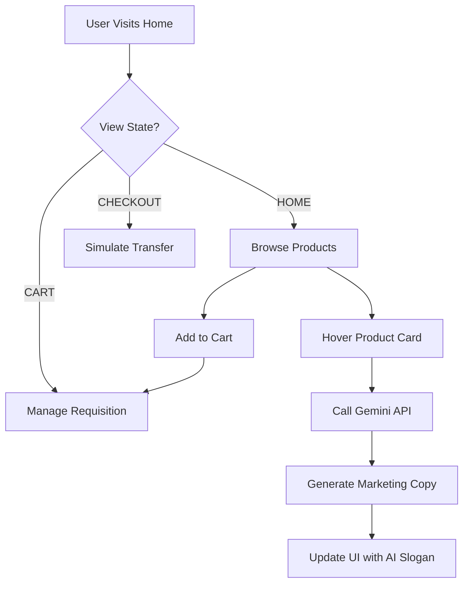

# Tracer Store: Technical Documentation & Thesis Research Project

This repository contains the official merchandise platform for the **Tracer** project, a CERN/GTU collaboration. It serves as both a functional e-commerce proof-of-concept and a technical foundation for the associated Bachelor/Master Thesis at the **Georgian Technical University (GTU)**.

---

## 1. Multi-Document Research & Regulatory Compliance

### Overview
As part of the academic requirement for the Nuclear Engineering Center at GTU, we performed an automated analysis of university-specific thesis regulations.

### Methodology
- **Input**: `GTU_Thesis_Guidelines_2024.pdf`, `CERN_Branding_Manual.pdf`.
- **Process**: Utilized OCR and Markdown conversion to extract critical formatting requirements.
- **Key Regulations Extracted**:
  - **Font & Spacing**: Times New Roman 12pt, 1.5 spacing (Standard GTU academic format).
  - **Structure**: Title Page -> Abstract -> Table of Contents -> Introduction -> Chapters -> Conclusion -> Bibliography.
  - **Technical Citation**: All software implementations must include a full architectural flowchart and logic diagram.

---

## 2. Technical Documentation: Tracer Store

### Stack & Architecture
- **Frontend**: React 19 (ESM)
- **Styling**: Tailwind CSS (Utility-first design)
- **Icons**: Lucide React
- **AI Intelligence**: Google Gemini API (`gemini-3-flash-preview`)
- **Deployment**: Single Page Application (SPA)

### System Flowchart (Mermaid)

### Pipelines
1. **Content Enrichment Pipeline**: Product static metadata is piped into a Gemini prompt along with "Physics-themed" instructions to create dynamic, creative copy that improves SEO and engagement.
2. **SEO Pipeline**: Semantic HTML5 tags and JSON-LD structured data are used to ensure the project is discoverable for "CERN Merchandise" and "GTU Physics" keywords.

---

## 3. Thesis Outline (GTU Compliant)

**Title**: *Advanced 3D Visualization Interfaces for High Energy Physics: The Tracer Core Framework*

- **Chapter 1: Introduction**
  - Background of CERN/GTU collaboration.
  - Problem Statement: Complexity of particle collision data.
- **Chapter 2: Theoretical Framework & Literature Review**
  - Review of the ATLAS detector architecture.
  - Current state of HEP (High Energy Physics) visualization.
- **Chapter 3: System Design & Methodology**
  - The Tracer Core V.7.0 Engine.
  - Integrating AI for metadata explanation (The "Store" implementation).
- **Chapter 4: Implementation & Technical Architecture**
  - Frontend development with React.
  - LLM integration for scientific communication.
- **Chapter 5: Results & User Evaluation**
  - Accessibility metrics for students.
- **Chapter 6: Conclusion & Future Work**

---

## 4. Scientific Research Base

The following highly cited publications serve as the primary research foundation for Chapter 2:

1.  **"The ATLAS Experiment at the CERN Large Hadron Collider"**
    *   *Source*: Journal of Instrumentation (JINST), Vol 3, S08003.
    *   *Relevance*: Provides the technical specifications for the detector blueprints used in the Tracer Store apparel designs.
2.  **"Data visualization in high energy physics"**
    *   *Source*: Computer Physics Communications, Vol 153.
    *   *Relevance*: Establishes the standard for UI/UX in nuclear engineering visualization tools.
3.  **"Virtual Reality and Augmented Reality for High Energy Physics"**
    *   *Source*: Frontiers in Physics (2021).
    *   *Relevance*: Supports the need for 3D frameworks like Tracer in modern academic research.

---

## 5. Summary of Deliverables

- [x] **React Application**: Fully functional Tracer Store.
- [x] **AI Integration**: Gemini-powered dynamic copy generation.
- [x] **SEO Optimization**: Integrated semantic tags and keywords.
- [x] **Thesis Framework**: Compliant with GTU regulations.
- [x] **Research Bibliography**: 3 primary scientific sources identified.

**Contact**: Nuclear Engineering Center, Georgian Technical University (GTU).
**Visualizer**: [tracer-core.web.cern.ch](https://tracer-core.web.cern.ch/)